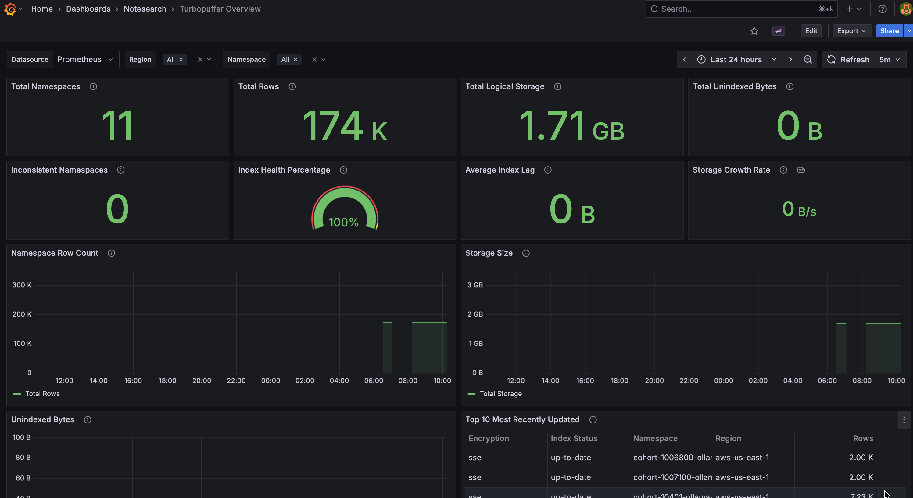

# Monitoring & Observability

The CLI includes a built-in Prometheus exporter that exports namespace metrics for monitoring and alerting.

## Prometheus Exporter

### Quick Start

Run the exporter using Docker:

```bash
docker run -d \
  --name tpuff-exporter \
  -p 9876:9876 \
  -e TURBOPUFFER_API_KEY=your_api_key \
  hevmind/tpuff-exporter:latest \
  --region aws-us-east-1
```

> [!TIP]
> **Best Practice**: Deploy one exporter per region where your data resides (e.g., `aws-us-east-1`, `gcp-us-central1`) rather than using `--all-regions`. This ensures better performance and isolation.

### Prometheus Configuration

Add this to your `prometheus.yml` to scrape the exporter:

```yaml
scrape_configs:
  - job_name: 'turbopuffer'
    scrape_interval: 60s
    static_configs:
      - targets: ['localhost:9876']
```

### Configuration Options

You can configure the exporter using environment variables or command-line flags.

**Environment Variables:**
- `TURBOPUFFER_API_KEY` (required): Your Turbopuffer API key

**Command Line Flags:**
- `--port <number>`: HTTP server port (default: 9876)
- `--region <region>`: Query specific region (default: TURBOPUFFER_REGION env)
- `--all-regions`: Query all Turbopuffer regions (not recommended for production)
- `--interval <seconds>`: Metric refresh interval (default: 60)
- `--timeout <seconds>`: API request timeout per region (default: 30)

### Endpoints

- `http://localhost:9876/metrics` - Prometheus metrics endpoint
- `http://localhost:9876/health` - Health check (JSON)
- `http://localhost:9876/` - Web UI with status information

### Exposed Metrics

- `turbopuffer_namespace_rows` - Approximate number of rows in namespace
- `turbopuffer_namespace_logical_bytes` - Approximate logical storage size in bytes
- `turbopuffer_namespace_unindexed_bytes` - Number of unindexed bytes
- `turbopuffer_namespace_info` - Namespace information with labels
- `turbopuffer_exporter_scrape_duration_seconds` - Time taken to fetch metrics
- `turbopuffer_exporter_last_scrape_timestamp_seconds` - Unix timestamp of last scrape

All metrics include labels: `namespace`, `region`, `encryption`, `index_status`.

## Grafana Dashboard

A comprehensive Grafana dashboard is included for visualizing Turbopuffer metrics.



**Features:**
- **17 monitoring panels** showing namespace health, storage trends, and index status
- **Real-time aggregate metrics** across all namespaces
- **2GB threshold alerts** with color-coded warnings
- **Index health monitoring** showing percentage of up-to-date indexes
- **Per-namespace breakdown** with sortable table

### Quick Start with Docker Compose

For a complete monitoring stack (Exporter + Prometheus + Grafana):

```yaml
version: '3.8'

services:
  tpuff-exporter:
    image: hevmind/tpuff-exporter:latest
    ports:
      - "9876:9876"
    environment:
      - TURBOPUFFER_API_KEY=${TURBOPUFFER_API_KEY}
    command: ["--region", "aws-us-east-1"]

  prometheus:
    image: prom/prometheus:latest
    ports:
      - "9090:9090"
    volumes:
      - ./prometheus.yml:/etc/prometheus/prometheus.yml
    command:
      - '--config.file=/etc/prometheus/prometheus.yml'

  grafana:
    image: grafana/grafana:latest
    ports:
      - "3000:3000"
    environment:
      - GF_SECURITY_ADMIN_PASSWORD=admin
    volumes:
      - ./grafana/provisioning:/etc/grafana/provisioning
      - ./grafana/dashboards:/var/lib/grafana/dashboards
```

## Observability Best Practices

1. **Exporter Deployment**: Run one exporter instance per region to minimize latency and improve reliability.
2. **Scraping Interval**: Scrape every 60 seconds. This balances data freshness with API rate limits.
3. **Alerting**:
   - **Warning**: Namespace >2GB unindexed data (potential performance impact).
   - **Critical**: Namespace >5GB unindexed data.
   - **Index Health**: Alert if <95% of namespaces are indexed.

## Building from Source

To build the exporter locally:

```bash
# Build the Docker image
docker build -f Dockerfile.exporter -t tpuff-exporter:latest .

# Run locally
docker run -d \
  --name tpuff-exporter \
  -p 9876:9876 \
  -e TURBOPUFFER_API_KEY=your_api_key \
  tpuff-exporter:latest
```
